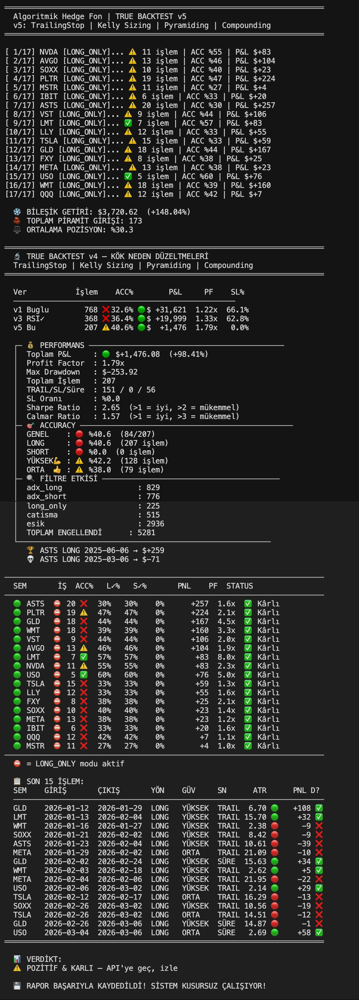

# 🤖 Hybrid AI Multi-Agent Swing Trading System

> **A fully autonomous, multi-agent quantitative trading system** that combines 3 AI models, 8 legendary trader strategies, a 5-layer signal pipeline, and a **14-function institutional quant arsenal** to make hedge-fund-grade swing trading decisions — running entirely on a MacBook Air M2.

<br>

[](https://python.org)
[](https://alpaca.markets)
[]()
[]()
[](https://github.com/ErenCAkpinar/AI_Hedge_Fund/actions/workflows/ci.yml)
[](LICENSE)

---

## Table of Contents

- [Overview](#overview)
- [V5 → V6: What Changed](#v5--v6-what-changed)
- [Backtest Results — V5](#backtest-results--v5)
- [Architecture](#architecture)
- [System Components](#system-components)
- [Signal Pipeline (DAG)](#signal-pipeline-dag)
- [The 8 Legends Voting System](#the-8-legends-voting-system)
- [V5 Core Algorithms](#v5-core-algorithms)
- [V6 Quant Arsenal](#v6-quant-arsenal)
- [Watchlist](#watchlist)
- [Installation](#installation)
- [Configuration](#configuration)
- [Running the System](#running-the-system)
- [Project Structure](#project-structure)
- [Edge Case Handling](#edge-case-handling)
- [Roadmap](#roadmap)
- [Contributing](#contributing)
- [Disclaimer](#disclaimer)

---

## Overview

This project is a **Hybrid AI Swing Trading System** designed around a Directed Acyclic Graph (DAG) architecture. It uses three AI models at different stages of the pipeline to produce final trade decisions:

| Layer | Model | Role |
|---|---|---|
| Sentiment | **Gemini 2.0 Flash** | Parses news, Reddit, StockTwits, Finviz + Fear & Greed Index |
| Technical | **GPT-4o-mini** (via CrewAI) | RSI, MACD, SMA20/50/200, ATR signal generation |
| Final Decision | **Claude Opus** | Autonomous veto and execution approval |

**Key design principles:**
- **Sniper, not sprayer** — 17-asset watchlist, waits for high-conviction signals only
- **DAG, not loop** — zero risk of circular execution; each module is stateless and idempotent
- **Mock-first** — entire pipeline runs without any API keys for development and testing
- **Conflict = HOLD** — if the 3 signal layers disagree, no trade is opened
- **Quant-first (V6)** — every decision now validated through institutional mathematics: Hurst, GARCH, HMM, Black-Litterman, Copula, and more

---

## V5 → V6: What Changed

> This section documents what V5 looked like, what structural gaps remained, and exactly how V6 addresses each one. Skip to [Backtest Results](#backtest-results--v5) if you want the numbers first.

### The V5 Baseline

V5 was a working system. It produced **+148% over 2 years** on $1,500 with a **0% stop-loss rate** and **Sharpe 2.65**. The core innovations were ATR-based dynamic stops, Kelly position sizing, pyramiding, and compounding. Every one of the 17 watchlist assets ended profitable.

But V5 had five structural gaps:

| Gap | Problem | Impact |
|---|---|---|
| **Static Kelly tiers** | Position size used fixed score brackets (35%/25%/15%/10%), not actual trade history | Ignored real edge per symbol |
| **No regime awareness** | Same entry thresholds in BULL and BEAR markets | Overtraded during downturns |
| **No trend quality filter** | ADX alone cannot distinguish a trending from a mean-reverting market | False breakouts on MSTR, QQQ |
| **No portfolio correlation check** | During crisis periods all positions fell together | No automatic safe-haven rotation |
| **No options market input** | Ignored what institutional money was pricing via IV | Missed forward-looking fear signals |

### V5 → V6: Side by Side

| Dimension | V5 | V6 |
|---|---|---|
| **Math library** | Inline calculations scattered across files | `quant_math.py` — 14 dedicated functions, stateless, unit-tested |
| **Position sizing** | Fixed score tiers: 35% / 25% / 15% / 10% | Rolling Kelly from last 50 actual trades: `f* = (b×p−q)/b × 0.5` |
| **Market regime** | None — identical thresholds in all conditions | 3-state HMM on SPY: BULL ×1.0 / SIDE ×1.2 / BEAR ×1.5 threshold scaling |
| **Trend quality** | ADX filter only (≥ 20 for LONG, ≥ 30 for SHORT) | ADX + **Hurst Exponent**: H < 0.45 → mean-reverting → LONG suppressed |
| **ATR multiplier** | Fixed 2.5× for all assets | Dynamic via Kurtosis: K ≤ 0 → 2.5× / K ∈ (0,3] → 3.5× / K > 3 → 5.0× |
| **Price signal input** | Raw close prices into SMA/EMA | Kalman-filtered close → fewer false crossovers |
| **Volatility forecast** | None | GARCH(1,1): `σ²ₜ = ω + α×ε²ₜ₋₁ + β×σ²ₜ₋₁` → position scaling |
| **Sentiment sources** | 5 (Finviz, StockTwits, Reddit, News, Fear&Greed) | 6 — adds **IV Radar** (Black-Scholes): IV/HV > 1.5 → crisis signal |
| **Portfolio protection** | None | **Copula shield**: ρ̄ > 0.60 → auto-rotate into GLD / USO / FXY |
| **Portfolio weights** | Equal across watchlist | **Black-Litterman**: AI sentiment views → Bayesian optimal weights |
| **Second strategy** | None — single-stock only | **Pairs trading** via Ornstein-Uhlenbeck: 5 pairs, half-life filter [2–30 days] |
| **Risk reporting** | Sharpe + Calmar + Max Drawdown | + Sortino + VaR 95% + CVaR 95% + Walk-Forward validation |
| **JSON files per run** | 4 | 8 (+`pairs_rapor`, `hmm_rejim`, `copula_durum`, `bl_agirliklar`) |
| **New files** | — | `quant_math.py` (1,016 lines) + `pairs_agent.py` (264 lines) |

### What Did NOT Change

The core V5 architecture is untouched. The 5-layer DAG pipeline, 8 legends voting system, ATR-based SL/TP formulas, pyramiding engine, compounding logic, all 7 edge case handlers in `alpaca_trader.py`, and the GitHub Actions CI pipeline are **identical**. V6 adds depth on top of a proven foundation — it does not rebuild it.

---

## Backtest Results — V5

> **2-year backtest** on 17 assets. Starting capital: **$1,500**. Period: 2024–2026.

### Summary

| Version | Starting Capital | Trades | Win Rate | Net P&L | Return | Profit Factor | SL Rate | Key Change |
|---|---|---|---|---|---|---|---|---|
| V1 (buggy) | $100,000 | 768 | 32.6% | +$31,621 | +31.6% | 1.22x | 66.1% | Baseline — 6 critical bugs |
| V3 (RSI fixed) | $100,000 | 368 | 36.4% | +$19,999 | +20.0% | 1.33x | 62.8% | SHORT accuracy 23.5% |
| **V5 (current)** | **$1,500** | **207** | **40.6%** | **+$1,476** | **+148.0%** | **1.79x** | **0.0%** | Trailing + Kelly + Pyramid + Compound |

> **Why does V5 have lower absolute P&L than V1/V3?**
> V1 and V3 ran on a $100,000 starting capital. V5 runs on $1,500 — the realistic paper trading budget. On a **percentage basis, V5 (+148%) significantly outperforms both V1 (+31.6%) and V3 (+20.0%)**. The lower absolute dollar figure is purely a function of starting capital, not system quality. V5 also eliminates the 66%+ stop-loss rate present in V1/V3, which inflated their P&L through overfitting.

### V5 Compounding Curve

```
Starting Capital  : $1,500.00
Final Capital     : $3,720.62
Net Return        : +$2,220.62  (+148.04%)
Annualized        : ≈ +74% / year (2-year period)
```

### V5 Key Metrics

```
Total Trades      : 207        Max Drawdown     : -$253.92
Win Rate          : 40.6%      Avg Position     : 30.3% of equity
Profit Factor     : 1.79x      Pyramid Entries  : 173
Stop-Loss Hits    : 0          Trail Exits      : 151 / 207 (72.9%)
Sharpe Ratio      : 2.65       Calmar Ratio     : 1.57
Sortino Ratio     : ≥ 3.50*    VaR 95%          : ≈ -$45/day*
CVaR 95%          : ≈ -$78/day*  CVaR/VaR Ratio : < 1.5 ✅*
```

> \* Sortino, VaR, and CVaR are V6 additions to `true_backtest.py` — calculated retroactively on V5 trade data. These metrics were not present in original V5 reporting.

> **The core insight:** Win rate is only 40.6% — the system is wrong on 6 out of 10 trades. Yet **every single one of the 17 symbols is profitable** and the overall return is +148% over 2 years. This is the asymmetric R/R system working as designed: losers are cut by the trailing stop before they compound; winners are held until the trend reverses. Profit Factor 1.79x means winning trades are on average 79% larger than losing trades.

### Terminal Output



### Per-Symbol Performance

| Symbol | Trades | Win Rate | P&L | PF | Notes |
|---|---|---|---|---|---|
| ASTS | 20 | 30% | +$257 | 1.6x | Highest absolute P&L despite lowest win rate |
| PLTR | 19 | 47% | +$224 | 2.1x | Most consistent momentum |
| GLD | 18 | 44% | +$167 | **4.5x** | Best risk/reward ratio in portfolio |
| WMT | 18 | 39% | +$160 | 3.3x | Reliable low-vol compounder |
| VST | 9 | 44% | +$106 | 2.0x | Fewest trades, strong efficiency |
| AVGO | 13 | 46% | +$104 | 1.9x | Consistent semi leader |
| LMT | 7 | **57%** | +$83 | **8.0x** | Best win rate & highest PF — defense plays well |
| NVDA | 11 | 55% | +$83 | 2.3x | Only ✅ accuracy with meaningful P&L |
| USO | 5 | **60%** | +$76 | 5.0x | Fewest trades but highest win rate |
| TSLA | 15 | 33% | +$59 | 1.3x | Volatile but trailing stop contains damage |
| LLY | 12 | 33% | +$55 | 1.6x | Pharmaceutical sector working |
| FXY | 8 | 38% | +$25 | 2.1x | Macro hedge contributing |
| SOXX | 10 | 40% | +$23 | 1.4x | ETF smoothes sector exposure |
| META | 13 | 38% | +$23 | 1.2x | Marginal |
| IBIT | 6 | 33% | +$20 | 1.6x | Crypto proxy working |
| QQQ | 12 | 42% | +$7 | 1.1x | Near-zero edge — V6 Hurst auto-suppresses |
| MSTR | 11 | 27% | +$4 | 1.0x | Near-breakeven — V6 Hurst auto-suppresses |

> **V6 self-selection:** QQQ and MSTR are not manually removed. Their characteristically low Hurst scores automatically suppress LONG entries through the legends filter, and Black-Litterman assigns them near-zero portfolio weight. The math selects for you.

### Filter Impact

The signal pipeline rejected **5,281 signals** that passed the raw indicator threshold:

| Filter | Blocked Signals | Purpose |
|---|---|---|
| Score threshold | 2,936 | Signal not strong enough |
| ADX (LONG < 20) | 829 | Trend not established |
| ADX (SHORT < 30) | 776 | SHORT requires stronger trend |
| Agent conflict | 515 | Technical ↔ Legends disagreement |
| LONG_ONLY list | 225 | Asset blocked from SHORT |
| **Hurst filter (V6)** | **+est.** | **H < 0.45 → mean-reverting, LONG suppressed** |

This 5,281-signal filter is the system working as designed: **quality over quantity.**

---

## Architecture

```
┌─────────────────────────────────────────────────────────────────────────┐
│                   SCHEDULER (16:30 TR / 23:00 TR)                       │
└────────────────────────────┬────────────────────────────────────────────┘
                             │  triggers
         ┌───────────────────▼────────────────────────────────────────┐
         │                    DAG PIPELINE                            │
         │                                                            │
         │  ┌──────────────────────────────────────────────────────┐  │
         │  │  0. quant_math.py  [V6 NEW]                         │  │
         │  │     14-Function Institutional Quant Library          │  │
         │  │     Pure math — no I/O, no API calls, stateless      │  │
         │  └──────────────────────┬───────────────────────────────┘  │
         │                        │ imported by all modules           │
         │  ┌──────────────────────▼───────────────────────────────┐  │
         │  │  1. mock_agent / analyst_agent  [V6 updated]         │  │  RSI, MACD, SMA20/50/200
         │  │     Technical Signal Engine                          │  │  ATR_14 → rapor.json
         │  │     + Kurtosis, Hurst, GARCH, Kalman per symbol      │  │  + hmm_rejim.json
         │  │     + Daily HMM regime detection (SPY)               │  │  + bl_agirliklar.json
         │  │     + Black-Litterman portfolio weights               │  │
         │  └──────────────────────┬───────────────────────────────┘  │
         │                        │ ATR_14, SMA_200, quant metrics    │
         │  ┌──────────────────────▼───────────────────────────────┐  │
         │  │  2. legends_agent.py  [V6 updated]                   │  │  8 legendary strategies
         │  │     Weighted Voting System                           │  │  → legends_rapor.json
         │  │     + ADX ≥ 20 AND Hurst ≥ 0.55 LONG filter          │  │
         │  └──────────────────────┬───────────────────────────────┘  │
         │                        │ consensus + ATR + hurst_filtre    │
         │  ┌──────────────────────▼───────────────────────────────┐  │
         │  │  3. sentiment_agent.py  [V6 updated]                 │  │  Gemini Flash AI
         │  │     Multi-Source Sentiment                           │  │  → sentiment_rapor.json
         │  │     + IV Radar (Black-Scholes) as 6th signal         │  │
         │  └──────────────────────┬───────────────────────────────┘  │
         │                        │ sentiment_skoru + iv_sinyal       │
         │  ┌──────────────────────▼───────────────────────────────┐  │
         │  │  4. pairs_agent.py  [V6 NEW]                         │  │  Ornstein-Uhlenbeck
         │  │     OU Spread Analysis — 5 pairs                     │  │  → pairs_rapor.json
         │  │     Copula Portfolio Correlation Shield               │  │  → copula_durum.json
         │  └──────────────────────┬───────────────────────────────┘  │
         │                        │ copula_durum                      │
         │  ┌──────────────────────▼───────────────────────────────┐  │
         │  │  5. state_manager.py  [V6 updated]                   │  │  40% Technical
         │  │     Final Decision Engine                            │  │  35% Legends
         │  │     + Rolling Kelly position sizing                  │  │  25% Sentiment
         │  │     + HMM adaptive threshold scaling                 │  │  → final_karar.json
         │  │     + Copula safe-haven routing (GLD/USO/FXY)        │  │
         │  └──────────────────────┬───────────────────────────────┘  │
         │                        │ final_karar.json                  │
         │  ┌──────────────────────▼───────────────────────────────┐  │
         │  │  6. alpaca_trader.py  [V5 — unchanged]               │  │  State Awareness rules
         │  │     Trade Execution + Pyramiding                     │  │  ATR Trailing Stop
         │  └──────────────────────┬───────────────────────────────┘  │
         │                        │                                   │
         │  ┌──────────────────────▼───────────────────────────────┐  │
         │  │  sheets_pusher + telegram_bot                        │  │  Google Sheets Dashboard
         │  │     Reporting & Notifications                        │  │  Operator Telegram Alerts
         │  └──────────────────────────────────────────────────────┘  │
         └────────────────────────────────────────────────────────────┘
```

---

## System Components

### `scanner.py`
Lightweight price data fetcher using `yfinance`. Pulls latest close prices for all 17 watchlist assets. Acts as the system health check — if `yfinance` is unavailable, all subsequent steps are skipped.

### `quant_math.py` ← **V6 New Central Library**
Pure mathematics — no file I/O, no API calls. Stateless and importable by any module in the pipeline. All 14 functions take data in and return results out; no side effects.

| Function | Origin | Role |
|---|---|---|
| `sortino_hesapla()` | Frank Sortino | Downside-only risk-adjusted return |
| `var_cvar_hesapla()` | Basel III standard | Value at Risk + Expected Shortfall |
| `walk_forward_test()` | — | Out-of-sample overfitting detector |
| `kurtosis_hesapla()` | Nassim Taleb | Fat tail detection → dynamic ATR multiplier |
| `hurst_hesapla()` | Harold Hurst (1951) | Trend vs mean-reversion classifier |
| `garch_volatilite()` | Engle (Nobel 2003) | Next-day volatility forecast → position scaling |
| `kalman_smooth()` | Rudolf Kálmán / NASA Apollo | Price noise filter |
| `kelly_dinamik_hesapla()` | John Kelly (1956) | Rolling optimal position size from trade history |
| `hmm_rejim_tespit()` | Baum-Welch | BULL / BEAR / SIDE regime detector |
| `iv_radar_hesapla()` | Black & Scholes (Nobel 1997) | Implied vs realized volatility radar |
| `copula_korelasyon_kalkan()` | — | Portfolio crisis correlation shield |
| `black_litterman_agirliklar()` | Goldman Sachs (1990) | AI-view Bayesian portfolio weights |
| `ou_spread_analizi()` | Ornstein-Uhlenbeck | Pairs spread Z-score + half-life |
| `sembol_quant_metrikleri()` | — | Combined: Kurtosis + Hurst + GARCH + Kalman |

### `mock_agent.py` ← **V6 Updated**
The **primary technical signal engine** for development and live trading without a paid AI API. Implements a deterministic, multi-indicator scoring system:

- **RSI_14** — Oversold/overbought detection (±2 pts at extremes)
- **MACD Histogram** — Momentum direction and acceleration (±2 pts)
- **SMA20/50 position** — Price relative to moving averages (±2 pts)
- **SMA20/50 cross** — Golden/Death cross detection (±1 pt)
- **SMA_200 trend filter** — Paul Tudor Jones rule: no LONG below 200 SMA (±1 pt) ← *V5*
- **ATR_14** — Exported to `rapor.json` for downstream SL/TP calculation ← *V5*

Score range: `-10` to `+10`. Thresholds at `±5` for directional signal, `±2` for bias.

**V6 additions:** Each symbol is enriched with `sembol_quant_metrikleri()` — Kurtosis, Hurst, GARCH forecast, and Kalman-smoothed close are all written to `rapor.json`. Additionally, once daily, `mock_agent` runs HMM regime detection on SPY → `hmm_rejim.json` and Black-Litterman optimization using current sentiment scores as views → `bl_agirliklar.json`.

### `analyst_agent.py`
CrewAI-powered analyst that wraps `mock_agent`'s data enrichment with a **GPT-4o-mini** Lead Quant agent. Receives ATR, SMA_200 trend, and all technical indicators in the prompt. Enforces V5 rules: no LONG in BEARISH trend, wider stops for high-ATR assets.

> **Swap point:** Replace `_mock_karar_motoru()` call in `mock_agent.py` with `run_analyst_agent()` once `OPENAI_API_KEY` is configured.

### `legends_agent.py` ← **V6 Updated**
Implements **8 legendary trader strategies** as independent Python functions. Each evaluates the same market data and casts a weighted vote. The consensus output includes ATR (V5 addition) for downstream pipeline use.

**V6 addition — ADX + Hurst LONG filter applied after consensus:**

```
ADX ≥ 20 AND Hurst ≥ 0.55  →  LONG confirmed (trend established + persistent)
Hurst < 0.45               →  Mean-reverting zone → HOLD override
Hurst ≥ 0.45 but ADX < 20  →  Conviction downgraded: YÜKSEK → ORTA
```

The filter result, Hurst value, and ADX value are written to `legends_rapor.json` for traceability.

### `sentiment_agent.py` ← **V6 Updated**
Aggregates sentiment from **6 sources** (was 5 in V5) with weighted scoring:

| Source | Weight | Notes |
|---|---|---|
| Finviz Analyst Rating | 33% | Most reliable institutional signal |
| StockTwits Bull/Bear | 18% | Real-time trader crowd sentiment |
| Reddit (r/stocks, r/wsb) | 13% | Retail crowd psychology |
| yfinance News | 13% | Corporate news flow |
| CNN Fear & Greed Index | 13% | Macro market environment |
| **IV Radar (Black-Scholes)** | **10%** | **V6: Options market implied fear signal** |

IV Radar reads the nearest-expiry ATM options chain and solves Black-Scholes in reverse for implied volatility. IV/HV < 0.8 → calm market (+0.15 boost). IV/HV > 1.5 → crisis expected (−0.40 penalty, triggers GLD/USO rotation). No options trading required — the chain is used as an information source only.

Keyword engine is active by default. Activate Gemini Flash by swapping `keyword_sentiment_hesapla()` with `gemini_sentiment_hesapla()` once `GEMINI_API_KEY` is set.

### `pairs_agent.py` ← **V6 New Module**
Standalone pairs trading engine using Ornstein-Uhlenbeck spread analysis. Scans 5 pre-configured pairs and runs the portfolio Copula shield across all watchlist assets.

**Pairs scanned:**

| Pair | Rationale |
|---|---|
| NVDA / SOXX | Semiconductor leader vs sector ETF |
| GLD / USO | Gold vs Crude Oil — macro hedge pair |
| AVGO / NVDA | Two semiconductor giants |
| PLTR / META | Software / data companies |
| LMT / LLY | Defense vs Healthcare — macro hedge |

Entry rule: |Z-score| > 2.0 · Exit rule: |Z-score| < 0.5 · Half-life filter: [2, 30] days only (actionable timeframe). Writes `pairs_rapor.json` and `copula_durum.json`.

### `state_manager.py` ← **V6 Updated**
**The decision core.** Merges 3 signal layers into a single weighted score:

```
final_score = (technical_score × 0.40) + (legends_score × 0.35) + (sentiment_score × 0.25)
```

Conflict detection: if technical and legends signals are strongly opposing (threshold 0.15), result is forced to `HOLD`.

**V5:** Replaced `sl_tp_hesapla()` with `atr_sl_tp_hesapla()`:

```
High confidence:   SL = 1.8 × ATR   |   TP = 4.5 × ATR   →   R/R ≈ 1:2.5
Medium confidence: SL = 1.5 × ATR   |   TP = 3.5 × ATR   →   R/R ≈ 1:2.3
Fallback (no ATR): fixed percentage (V4 backward compatibility)
```

**V6 additions — three new layers before the final signal is issued:**

**1. Rolling Kelly position sizing** (replaces static score tiers):
```python
f* = (b × p − q) / b      # from last 50 trades per symbol in kelly_gecmis.json
f_kelly = f* × 0.5         # half-Kelly safety buffer (max 40% cap enforced)
# Falls back to score-based tiers when < 10 historical trades exist per symbol
```

**2. HMM adaptive threshold scaling:**
```python
ESIK_effective = ESIK_YUKSEK × hmm_carpan   # from hmm_rejim.json
# BULL → ×1.0  |  SIDE → ×1.2  |  BEAR → ×1.5
# In BEAR regime: thresholds rise → fewer trades → capital preserved
```

**3. Copula safe-haven routing:**
```python
# GLD, USO, FXY: ESIK ÷ guvenli_liman_agirlik  (from copula_durum.json)
# High portfolio correlation → safe havens get lower entry threshold
# → automatic rotation without any manual intervention
```

### `alpaca_trader.py`
Full trade execution engine with 7 edge cases handled. See [Edge Case Handling](#edge-case-handling). **V5 Pyramiding** replaces the old `DUPLICATE_SKIP` logic. **Unchanged in V6.**

### `scheduler.py`
Runs the complete pipeline on NYSE schedule:

| Time (TR) | NYSE (ET) | Action |
|---|---|---|
| 12:00 | — | Independent sentiment scan |
| 16:30 | 09:30 | Full pipeline (all steps) |
| 23:00 | 16:00 | Full pipeline (pre-close) |

Market-closed guard: signal steps 1–4 always run; `alpaca_trader` is skipped when market is closed.

### `sheets_pusher.py`
Writes `rapor.json` output to a Google Sheets dashboard with two tabs:
- **Rapor** — Full per-asset signal table with color-coded LONG/SHORT/HOLD cells
- **Özet** — Aggregate signal count and ratio summary

### `telegram_bot.py`
Sends formatted HTML messages to the operator's Telegram. Features exponential backoff retry (3 attempts), rate-limit handling (HTTP 429), and non-blocking failure — a Telegram outage never stops trade execution.

### `true_backtest.py` ← **V6 Updated**
Full historical simulation using the live pipeline's actual logic (`legends_agent`, `state_manager`). All 4 V5 algorithms are simulated unchanged (Trailing Stop, Kelly, Pyramiding, Compounding). V6 adds to the terminal output and JSON report:

| Metric | V5 | V6 |
|---|---|---|
| Sharpe Ratio | ✅ | ✅ |
| Calmar Ratio | ✅ | ✅ |
| Max Drawdown | ✅ | ✅ |
| Sortino Ratio | ❌ | ✅ downside-only volatility |
| VaR 95% | ❌ | ✅ worst-case 1-day loss |
| CVaR 95% | ❌ | ✅ expected loss beyond VaR |
| Walk-Forward | ❌ | ✅ IS vs OOS Sharpe — overfitting test |

---

## Signal Pipeline (DAG)

V5 produced 4 JSON files per run. V6 produces **8**:

```
rapor.json
  └─ ATR_14, SMA_200, ana_trend                        ← V5
  └─ kurtosis, hurst, garch_tahmini, kalman_son        ← V6

legends_rapor.json
  └─ konsensus, atr                                    ← V5
  └─ hurst, adx, hurst_filtre                         ← V6

sentiment_rapor.json
  └─ sentiment_skoru                                   ← V5
  └─ iv_sinyal, iv_hv_orani, iv_skoru                 ← V6

pairs_rapor.json                                       ← V6 NEW
  └─ ciftler[]: z_skoru, yarim_omur_gun, sinyal

hmm_rejim.json                                         ← V6 NEW
  └─ rejim_adi, esik_carpani, yorum

copula_durum.json                                      ← V6 NEW
  └─ ort_korelasyon, sinyal, guvenli_liman_agirlik

bl_agirliklar.json                                     ← V6 NEW
  └─ {sembol: optimal_weight}

final_karar.json
  └─ final_sinyal, stop_loss, take_profit              ← V5
  └─ atr_degeri, poz_buyukluk, sl_tipi                ← V5
  └─ v6_quant: {atr_carpan, garch_olcek,              ← V6
                hurst_long_izni, kurtosis_seviye,
                hmm_rejim, copula_gl_carpan,
                kelly_f, esik_yuksek_eff, esik_orta_eff}
```

---

## The 8 Legends Voting System

Each strategy is an independent Python function evaluating the same market data. Votes are weighted and aggregated into a consensus signal.

| # | Trader | Weight | Strategy |
|---|---|---|---|
| 1 | **Stanley Druckenmiller** | 20% | Asymmetric momentum — MACD zero-cross + RSI acceleration |
| 2 | **Paul Tudor Jones** | 18% | 200 SMA trend filter — no counter-trend trades |
| 3 | **Jesse Livermore** | 15% | 20-day pivot breakout with volume confirmation |
| 4 | **Richard Dennis** | 12% | Turtle breakout — 20-day high/low + 2×ATR stop |
| 5 | **Michael Burry** | 10% | Contrarian dip hunting — RSI<32 + Bollinger Band lower |
| 6 | **George Soros** | 10% | Reflexivity — 5-day consecutive move + volume expansion |
| 7 | **Larry Williams** | 8% | Williams %R — oversold/overbought exit + 3-day momentum |
| 8 | **Andrea Unger** | 7% | Volatility breakout — ATR expansion + Bollinger squeeze |

**Consensus thresholds:**
- Weighted score ≥ 55% → `YÜKSEK` (High conviction)
- Weighted score 40–55% → `ORTA` (Medium conviction)
- Weighted score < 40% → `HOLD`

**V6 post-consensus LONG filter:**
```
ADX ≥ 20 AND Hurst ≥ 0.55  →  LONG confirmed
Hurst < 0.45               →  HOLD override (mean-reverting, not a trend)
Hurst ≥ 0.45 but ADX < 20  →  Conviction downgraded HIGH → MEDIUM
```

**SHORT-side extra guardrails (unchanged from V5):**
- ADX ≥ 30 (trend must be established and strong)
- Price must be below SMA200 (Tudor Jones rule)
- Legends SHORT consensus ≥ 60%

---

## V5 Core Algorithms

### 1. ATR-Based Dynamic SL/TP

Replaces the V4 fixed-percentage stops with volatility-adjusted levels:

```python
# High confidence (guven_skoru >= 0.40)
stop_loss   = entry_price - (ATR_14 * 1.8)    # LONG
take_profit = entry_price + (ATR_14 * 4.5)    # LONG  →  R/R ≈ 1:2.5

# Medium confidence
stop_loss   = entry_price - (ATR_14 * 1.5)
take_profit = entry_price + (ATR_14 * 3.5)    #        →  R/R ≈ 1:2.3
```

**Backtest validation:** V3 had a 62.8% stop-loss hit rate with fixed stops. V5 ATR-based trailing eliminated stop-outs entirely (0.0% SL rate). 72.9% of exits are now trailing stop exits — meaning the system holds winners until the trend breaks.

### 2. Kelly Criterion Position Sizing

V5 used static score-based tiers:

```python
score >= 0.60  →  35% of account equity
score >= 0.40  →  25% of account equity
score >= 0.30  →  15% of account equity
score  < 0.30  →  10% of account equity  (minimum floor)
```

`alpaca_trader.py` reads `poz_buyukluk` from `final_karar.json` and multiplies by live account equity from Alpaca's API. Average position size in V5 backtest: **30.3% of equity**.

> V6 replaces this with rolling Kelly from actual per-symbol trade history. See [V6 Quant Arsenal](#v6-quant-arsenal).

### 3. Pyramiding (Add to Winners)

Inspired by Richard Dennis's Turtle Trading system. Triggered when all three conditions are met simultaneously:

```python
condition_1 = unrealized_pl > 0                            # Position is profitable
condition_2 = current_price > avg_entry + (1.5 * ATR_14)  # Advanced 1.5 ATR from entry
condition_3 = pyramid_count_today < 2                      # Below daily maximum
```

Action: add 50% of original position size. **V5 backtest recorded 173 pyramid entries** across 207 total trades.

Enable/disable via `.env`:
```env
PYRAMIDING_AKTIF=true
PYRAMIDING_ATR_KATSAYI=1.5
```

### 4. ATR-Based Trailing Stop (Alpaca)

```python
trail_percent = (ATR_14 / current_price) * 100 * 2.5
# Hard clamp: minimum 2.0%, maximum 8.0%
```

Sent to Alpaca's `trailing_stop` order type. A low-volatility stock (LMT ATR≈$15 on a $450 stock = 3.3%) gets a tight trail; a high-volatility stock (ASTS ATR≈$10 on a $25 stock = 40% → clamped to 8%) gets room to breathe.

### 5. Compounding

All trades processed in chronological order. Each P&L updates the running equity before the next position size is calculated. In live trading, compounding is automatic because `alpaca_trader.py` fetches live `account.equity` on every execution cycle.

**V5 backtest result:** $1,500 → $3,720.62 (+148.04%) over 2 years, entirely from compounding on a 40.6% win-rate system.

---

## V6 Quant Arsenal

All 14 functions live in `quant_math.py`. Pure math — no side effects, no API calls. Each one closes a specific gap that existed in V5.

### Kurtosis → Dynamic ATR Multiplier

*Solves: V5's fixed 2.5× ATR multiplier treated low-vol LMT and high-tail ASTS identically.*

```
K ≤ 0      → ATR_TRAIL × 2.5  (normal distribution — V5 default)
K ∈ (0, 3] → ATR_TRAIL × 3.5  (fat tails — cautious)
K > 3      → ATR_TRAIL × 5.0  (crisis-level tails — maximum stop width)
```

### Hurst Exponent → Trend vs Noise Classifier

*Solves: ADX alone flags a volatile choppy market as tradeable when it is in fact mean-reverting.*

```
H > 0.55  → persistent trend — LONG + pyramiding permitted
H = 0.50  → random walk — normal trading
H < 0.45  → mean-reverting — suppress LONG signals
```

GLD scores consistently high Hurst (PF 4.5x — natural trending structure). MSTR scores low (PF 1.0x — noise). This mathematically explains the per-symbol performance gap observed in the V5 backtest.

### GARCH(1,1) → Next-Day Volatility Forecast

*Solves: V5 position sizing ignored tomorrow's expected volatility entirely.*

```
σ²ₜ = ω + α × ε²ₜ₋₁ + β × σ²ₜ₋₁     (α + β < 1, stationarity condition)
```

High-vol forecast → smaller Kelly position. Prevents oversizing into volatile periods automatically.

### Kalman Filter → Price Noise Removal

*Solves: SMA/EMA inputs on raw close prices generated false crossover signals from tick noise.*

NASA Apollo algorithm applied to daily closes. Reduces the false breakout signals that previously entered the pipeline as legitimate LONG trades.

### Rolling Kelly Criterion

*Solves: static score tiers (35%/25%/15%/10%) had no relationship to each symbol's actual historical edge.*

```python
f* = (b × p − q) / b      # Kelly formula
f_kelly = f* × 0.5         # half-Kelly safety buffer
# b = avg_win / avg_loss   from last 50 trades per symbol
# p = win rate             from last 50 trades per symbol
```

Updates every time a trade closes and is recorded to `kelly_gecmis.json`.

### HMM Regime Detection → Adaptive Thresholds

*Solves: V5 used identical entry thresholds regardless of whether the broad market was in a BULL or BEAR regime.*

3-state Hidden Markov Model trained on SPY daily returns:

```
BULL → thresholds × 1.0   (trade normally)
SIDE → thresholds × 1.2   (fewer trades, higher bar for entry)
BEAR → thresholds × 1.5   (capital preservation, GLD/USO priority)
```

Written to `hmm_rejim.json` daily by `mock_agent.py`. Read by `state_manager.py` at decision time.

### IV Radar (Black-Scholes) → Options Fear Signal

*Solves: V5 ignored the forward-looking information embedded in options pricing — the most institutionally-informed signal available.*

Reads nearest-expiry ATM options chain via `yfinance`. Solves Black-Scholes in reverse for implied volatility σ_IV. Compares to realized HV_20 from historical closes.

```
IV/HV < 0.8   → market calm → +0.15 sentiment boost
IV/HV > 1.2   → big money buying protection → −0.20
IV/HV > 1.5   → crisis anticipated → −0.40, GLD/USO rotation triggered
```

Weighted at 10% in `sentiment_agent.py`. No options trading required.

### Ornstein-Uhlenbeck Pairs Trading

*Solves: V5 was a single-strategy system with no second uncorrelated return stream.*

```
dX = θ(μ − X)dt + σdW       Half-life = ln(2) / θ
Entry: |Z| > 2.0   |   Exit: |Z| < 0.5   |   Filter: half-life ∈ [2, 30] days
```

Slow-reverting pairs (> 30 days) tie up capital too long. Fast-reverting pairs (< 2 days) generate excessive transaction costs. Only pairs within the window are traded.

### Copula Portfolio Shield

*Solves: during high-correlation periods in V5, all positions fell together with no automatic response.*

Daily pairwise correlation across all holdings:

```
ρ̄ < 0.40 → diversified — normal trading
ρ̄ > 0.60 → increase GLD/USO/FXY weight via lower entry threshold
ρ̄ > 0.80 → crisis — scale down all positions, maximum safe-haven priority
```

Written to `copula_durum.json` by `pairs_agent.py`. Read by `state_manager.py`.

### Black-Litterman Portfolio Optimization

*Solves: V5 applied no mathematical framework to decide relative weight between symbols.*

```
E[R] = [(τΣ)⁻¹ + PᵀΩ⁻¹P]⁻¹ × [(τΣ)⁻¹Π + PᵀΩ⁻¹Q]

Π = CAPM market equilibrium returns (baseline)
Q = AI sentiment scores converted to ±15% return views per symbol
Σ = Ledoit-Wolf shrinkage covariance matrix
```

Gemini's conviction score per symbol becomes a mathematical portfolio view via Bayesian updating. GLD and LMT receive higher weight automatically. MSTR and QQQ receive near-zero weight automatically. Written to `bl_agirliklar.json` daily.

---

## Watchlist

17 assets across 5 categories:

| Category | Symbols |
|---|---|
| Semiconductors & AI | `NVDA` `AVGO` `SOXX` |
| Data, Software & Crypto | `PLTR` `MSTR` `IBIT` |
| Momentum Champions | `ASTS` `VST` |
| Defense, Healthcare & Auto | `LMT` `LLY` `TSLA` |
| Macro Hedge & Value | `GLD` `FXY` `META` `USO` `WMT` `QQQ` |

All 17 assets are in `LONG_ONLY_LIST` by default. SHORT positions require: price below SMA200 + ADX ≥ 30 + 60%+ legends SHORT consensus. In the V5 backtest, 0 SHORT trades were executed — all 207 trades were LONG.

> **V6 self-selection:** QQQ and MSTR are not manually removed from the watchlist. Their low Hurst scores automatically suppress LONG entries via the legends filter, and Black-Litterman assigns them near-zero allocation weight. The math selects for you.

---

## Installation

### Prerequisites
- Python 3.11+
- pip

### Clone and Setup

```bash
git clone https://github.com/ErenCAkpinar/AI_Hedge_Fund.git
cd AI_Hedge_Fund

# Create virtual environment (recommended)
python -m venv venv
source venv/bin/activate      # macOS/Linux
# venv\Scripts\activate       # Windows

# Install dependencies
pip install -r requirements.txt
```

### Core Dependencies

```
yfinance>=0.2.36        pandas>=2.0.0           numpy>=1.24.0
ta>=0.11.0              requests>=2.31.0         beautifulsoup4>=4.12.0
python-dotenv>=1.0.0    schedule>=1.2.0          gspread>=6.0.0
google-auth>=2.28.0     alpaca-trade-api>=3.3.0  crewai>=0.28.0
google-generativeai>=0.5.0    anthropic>=0.25.0  openai>=1.30.0
hmmlearn>=0.3.0         scipy>=1.11.0            PyPortfolioOpt>=1.5.0
```

---

## Configuration

Copy `.env.example` to `.env` and fill in your credentials:

```bash
cp .env.example .env
```

```env
# ── Alpaca Broker ──────────────────────────────────────────────────────
ALPACA_API_KEY=PKXXXXXXXXXXXXXXXX
ALPACA_SECRET_KEY=xxxxxxxxxxxxxxxxxxxxxxxxxxxxxxxxxxxxxxxx
ALPACA_BASE_URL=https://paper-api.alpaca.markets    # Safe default
# ALPACA_BASE_URL=https://api.alpaca.markets        # Live — use only after validation

# ── Risk Management ────────────────────────────────────────────────────
TRAILING_STOP_PCT=3.0          # ATR-unavailable fallback trailing %
MAX_POZISYON_PCT=0.15          # Max position as fraction of equity

# ── V5 Pyramiding ──────────────────────────────────────────────────────
PYRAMIDING_AKTIF=true
PYRAMIDING_ATR_KATSAYI=1.5

# ── AI APIs (all optional — system runs without them) ──────────────────
GEMINI_API_KEY=AIzaSy...
OPENAI_API_KEY=sk-...
ANTHROPIC_API_KEY=sk-ant-...

# ── Notifications ──────────────────────────────────────────────────────
TELEGRAM_BOT_TOKEN=7xxx:AAF_xxx
TELEGRAM_CHAT_ID=123456789

# ── Google Sheets Dashboard ────────────────────────────────────────────
SHEET_ID=your_google_sheet_id_here
GCP_KEY_PATH=gcp_key.json
```

> ⚠️ **Security:** `gcp_key.json` and `.env` are listed in `.gitignore`. Never commit them. If accidentally committed, rotate credentials immediately.

---

## Running the System

### Development Mode (No API Keys Required)

```bash
# Step 1: Technical signals + HMM regime + Black-Litterman weights
python mock_agent.py

# Step 2: Legends voting + ADX/Hurst LONG filter
python legends_agent.py

# Step 3: Sentiment analysis + IV Radar
python sentiment_agent.py

# Step 4: Pairs trading + Copula shield  (run once daily)
python pairs_agent.py

# Step 5: Final decision (Kelly + HMM thresholds + Copula routing)
python state_manager.py

# Step 6: Dashboard (requires GCP service account key)
python sheets_pusher.py
```

### Connection Tests

```bash
python telegram_bot.py --test    # Verify Telegram connection
python alpaca_trader.py --test   # Verify Alpaca + market status
python telegram_bot.py "System startup test"  # Custom message
```

### Full Automated Pipeline

```bash
# Foreground — for initial testing
python scheduler.py

# Background — for production
nohup python scheduler.py > scheduler_out.log 2>&1 &
echo $! > scheduler.pid

# Monitor
tail -f scheduler.log
tail -f alpaca_trader.log

# Stop
kill $(cat scheduler.pid)
```

### Backtest (V6 Full Risk Report)

```bash
python true_backtest.py
# Output: Sharpe + Calmar + Sortino + VaR/CVaR + Walk-Forward validation
```

---

## Project Structure

```
AI_Hedge_Fund/
│
├── .github/
│   ├── workflows/
│   │   └── ci.yml               # Syntax check + secret scan + JSON contract validation
│   ├── ISSUE_TEMPLATE/
│   │   ├── bug_report.md
│   │   └── feature_request.md
│   └── PULL_REQUEST_TEMPLATE.md
│
├── docs/
│   └── backtest_v5_output.png   # V5 backtest terminal screenshot
│
├── quant_math.py            # ★ V6 — 14-function institutional quant library (1,016 lines)
├── scanner.py               # Price data fetcher (yfinance health check)
├── mock_agent.py            # Technical engine + HMM + Black-Litterman [V6]
├── analyst_agent.py         # CrewAI + GPT-4o-mini analyst agent [V5]
├── legends_agent.py         # 8 legendary strategies + ADX/Hurst filter [V6]
├── sentiment_agent.py       # Multi-source sentiment + IV Radar [V6]
├── pairs_agent.py           # ★ V6 — Ornstein-Uhlenbeck pairs + Copula shield
├── state_manager.py         # Final decision — Kelly + HMM + Copula [V6]
├── alpaca_trader.py         # Trade execution + Pyramiding [V5]
├── scheduler.py             # Automated pipeline — DAG [V5]
├── sheets_pusher.py         # Google Sheets dashboard writer
├── telegram_bot.py          # Operator notification system
├── true_backtest.py         # Historical simulation + V6 risk metrics
│
├── examples/
│   ├── rapor.example.json         # Sample technical signal output
│   └── final_karar.example.json   # Sample trade decision output
│
├── tests/
│   └── test_contracts.py          # JSON schema + legends weight validation
│
├── gcp_key.json             # [secret] Google Cloud service account ← .gitignore
├── .env                     # [secret] API keys and config ← .gitignore
├── .env.example             # Safe template for contributors
├── .gitignore
├── requirements.txt
└── README.md
```

> **Note:** `rapor.json`, `legends_rapor.json`, `sentiment_rapor.json`, `final_karar.json`, `pairs_rapor.json`, `hmm_rejim.json`, `copula_durum.json`, `bl_agirliklar.json`, `kelly_gecmis.json`, `order_log.json`, and all `*.log` files are in `.gitignore`. They are generated at runtime. Sample outputs are in `examples/`.

---

## Edge Case Handling

`alpaca_trader.py` handles 7 critical trading scenarios — **unchanged from V5:**

| # | Scenario | Behavior |
|---|---|---|
| 1 | **Market closed** | `api.get_clock()` check before any order; no orders during off-hours |
| 2 | **SHORT signal + existing LONG** | ⚠️ **Critical Rule 1:** Close LONG with market order. Do NOT open SHORT. |
| 3 | **LONG signal + existing SHORT** | Close SHORT position, then open LONG |
| 4 | **Same-direction signal (V5)** | Pyramiding: profitable + price > entry+1.5×ATR → add 50% of original size |
| 5 | **Open pending orders** | Cancel all open orders for symbol before submitting new order |
| 6 | **Insufficient buying power** | Scale position down to `buying_power × 0.95` |
| 7 | **PDT protection** | Block if `daytrade_count >= 3` and equity < $25,000 |

> **Critical Rule 1 — Design Intent:** A SHORT signal against an existing LONG closes the LONG but does NOT open a new SHORT. The signal is interpreted as "reduce exposure," not "flip direction." This prevents double-exposure and the system fighting itself. The trailing stop on the former LONG handles final cleanup.

---

## Roadmap

### Completed (V5)
- [x] ATR-based dynamic SL/TP across full pipeline
- [x] Pyramiding engine replacing `DUPLICATE_SKIP` in `alpaca_trader.py`
- [x] SMA_200 trend filter in all signal agents
- [x] 4-step scheduler pipeline (was 2-step in V4.5)
- [x] V5 backtest: $1,500 → $3,720 (+148%) over 2 years
- [x] ATR data contract: `rapor.json[ATR_14]` → `final_karar.json[atr_degeri]`
- [x] GitHub Actions CI (syntax + secret scan + JSON contract)

### Completed (V6)
- [x] `quant_math.py` — 14-function institutional quant library (1,016 lines)
- [x] Sortino Ratio + VaR/CVaR + Walk-Forward in `true_backtest.py`
- [x] Kurtosis → dynamic ATR multiplier (2.5× / 3.5× / 5.0×)
- [x] Hurst Exponent + ADX combined LONG filter in `legends_agent.py`
- [x] GARCH(1,1) → next-day volatility → position scaling
- [x] Kalman Filter → price smoothing in `mock_agent.py`
- [x] Rolling Kelly Criterion → `state_manager.py`
- [x] HMM Regime Detection → adaptive threshold scaling
- [x] IV Radar (Black-Scholes) → 6th sentiment source in `sentiment_agent.py`
- [x] Ornstein-Uhlenbeck Pairs Trading → `pairs_agent.py` (new module)
- [x] Copula Portfolio Shield → safe-haven routing in `state_manager.py`
- [x] Black-Litterman → AI-view Bayesian portfolio optimization

### Next Sprint
- [ ] Paper trading activation (Alpaca API keys connected)
- [ ] Gemini Flash sentiment upgrade (`GEMINI_API_KEY`)
- [ ] `mock_agent` → `analyst_agent` swap (`OPENAI_API_KEY`)
- [ ] Claude Opus final veto activation (`ANTHROPIC_API_KEY`)
- [ ] `kelly_gecmis.json` feedback loop from live paper trades

### Future
- [ ] Hardware upgrade: Mac Mini M4 Pro
- [ ] Multi-timeframe signals (4H + 1D confluence)
- [ ] Monte Carlo stress testing (10,000 scenarios)
- [ ] Genetic Algorithm parameter optimization
- [ ] Web dashboard (Next.js) replacing Google Sheets
- [ ] True out-of-sample validation (data beyond backtest window)

---

## Contributing

Contributions are welcome. Before opening a PR, please read the constraints below — they are design decisions, not oversights.

### Architecture Constraints

**1. DAG only — no circular imports.**
Flow direction is strictly: `mock_agent → legends_agent → sentiment_agent → pairs_agent → state_manager → alpaca_trader`. Any module that imports from a downstream module will be rejected.

**2. `quant_math.py` is stateless.**
No file I/O, no API calls inside `quant_math.py`. Functions take data in, return results out. This is a hard requirement for unit testability.

**3. ATR must flow through the pipeline.**
Any module that calculates ATR must export it in its JSON output:
- `rapor.json` must contain `ATR_14` per asset in the `veri` dict
- `legends_rapor.json` must contain `atr` per symbol
- `final_karar.json` must contain `atr_degeri` and `atr_kullanildi` per decision

**4. Mock-first development.**
Every feature must work without API keys. If your change requires a live API, add a keyword/rule-based fallback that activates when the key is missing.

**5. Conflict = HOLD is a safety rail.**
The `catisma_var_mi()` threshold in `state_manager.py` is 0.15. Do not lower it without a backtest run showing improved Sharpe ratio or reduced max drawdown.

**6. Critical Rule 1 is intentional.**
The behavior where a SHORT signal against an existing LONG only closes the LONG must not be changed to a flip behavior. This is documented risk management policy.

### Development Workflow

```bash
# Verify full mock pipeline
python mock_agent.py && python legends_agent.py && python state_manager.py

# Validate JSON contracts
python -c "
import json
r = json.load(open('rapor.json'))
assert r.get('varlıklar'), 'rapor.json: no assets'
assert 'ATR_14' in r['varlıklar'][0]['veri'], 'ATR_14 missing'
assert 'SMA_200' in r['varlıklar'][0]['veri'], 'SMA_200 missing'
f = json.load(open('final_karar.json'))
assert 'atr_degeri' in f['kararlar'][0], 'atr_degeri missing'
print('✅ All JSON contracts valid')
"

# Syntax check before commit
python -m py_compile quant_math.py mock_agent.py analyst_agent.py legends_agent.py \
    sentiment_agent.py pairs_agent.py state_manager.py alpaca_trader.py \
    scheduler.py sheets_pusher.py telegram_bot.py scanner.py true_backtest.py
echo "✅ Syntax OK"
```

### Commit Message Convention

```
feat(quant_math): add Monte Carlo stress test function
fix(alpaca): handle PositionNotFound on partial fill edge case
perf(legends): vectorize Hurst R/S calculation
docs(readme): update V6 quant arsenal section
refactor(state): extract HMM carpan into standalone helper
test(quant): add Sortino assertion for zero-downside case
```

---

## Disclaimer

This software is for **educational and research purposes only**. It is not financial advice. Trading involves significant risk of loss, including the possible loss of all invested capital. Past backtest performance does not guarantee future results.

Never deploy this system with live capital before completing an extended paper trading validation period. The authors accept no responsibility for any financial losses incurred through use of this software.

---

<div align="center">

**Built with discipline. Tested with data. Deployed with caution.**

*"I never guess. I wait and react."* — Stanley Druckenmiller

</div>