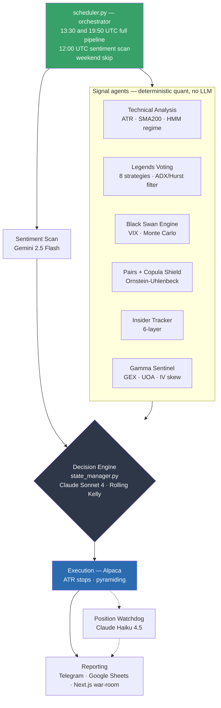
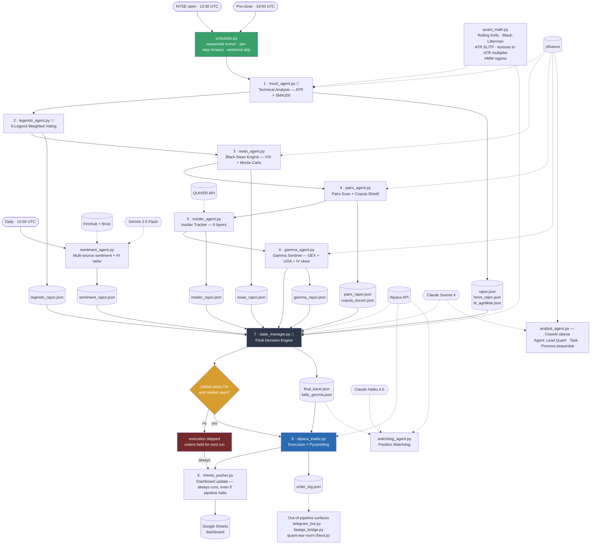

# Architecture

Multi-agent swing-trading system. Six deterministic quant agents produce evidence,
a Claude-backed decision engine fuses it into a single sized order, and Alpaca
executes it — orchestrated by a scheduler that gates execution on critical-step
success and market hours.

Diagrams below are generated from the live source (`scheduler.py` → `PIPELINE_ADIMLARI`),
not from an idealized design.

---

## 1. System Overview

---

## 2. Full Technical Flow

Solid arrows = control/data flow · dotted arrows = external tools and data sources ·
cylinders = JSON artifacts exchanged between agents · 🔴 = critical step (failure
aborts execution).

---

## Architecture notes

- **File-based message passing.** Agents are standalone processes that communicate
  through versioned JSON artifacts rather than in-memory objects. Any step can be
  re-run in isolation, and every decision is reproducible from the artifacts on disk.
- **Critical-step gating.** `mock_agent`, `legends_agent` and `state_manager` are
  marked critical. If one fails, the scheduler refuses to place orders instead of
  trading on partial evidence — a fail-closed default.
- **Timeout guards.** Each step runs under its own timeout and is terminated if it
  overruns, so one hung data provider cannot stall the trading window.
- **Fail-visible dashboard.** `sheets_pusher.py` is on an always-run list: even when
  a critical failure halts trading, the dashboard is still updated — a failed run is
  never silent.
- **Hybrid LLM routing.** The six signal agents are fully deterministic quant code —
  no LLM in the hot path. Language models are used only where judgment beats
  arithmetic: final decision synthesis (Claude Sonnet 4), news/sentiment extraction
  (Gemini 2.5 Flash), and position supervision (Claude Haiku 4.5). This keeps cost
  and non-determinism out of signal generation.
- **Market-aware execution.** Order placement is skipped when the market is closed;
  the decision is preserved and acted on at the next open.
- **Shared quant core.** `quant_math.py` is pure, stateless math (Rolling Kelly,
  Black-Litterman, ATR-based stops, kurtosis-scaled risk multipliers, HMM regime)
  imported by both the signal and decision layers, so sizing rules cannot drift
  between them.

> Paper-trading system. Nothing here is investment advice.
